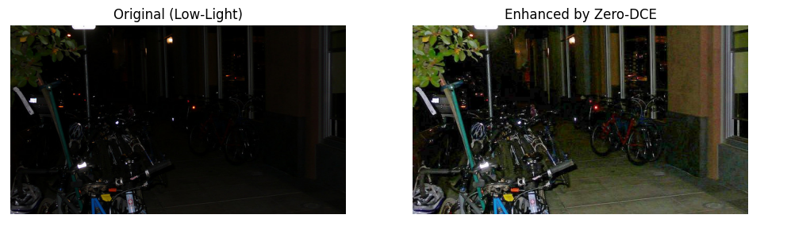

# LowLight_Image_Enhancer
This project implements Zero-DCE, a lightweight deep learning model for enhancing low-light images without paired training data. The goal is to improve the visibility and quality of images taken under poor lighting conditions.    
It can be used for enhancing security camera footage, improving drone images, or refining photos taken for hobby purposes.


# File Structure

```
├── Zero-DCE
├── Zero-DCE_code
|   └── lowlight_test.py
│   └── data
│       └── test_data
│           └── ExDark_flat
|
├── snapshots
│   └── epoch99.pth
|
```
# Example Output

